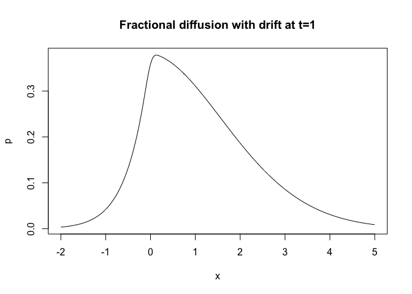

<!-- README.md is generated from README.Rmd. Please edit that file -->
MittagLeffleR
=============

The MittagLeffleR `R` package calculates probabilities, quantiles and random variables from both types Mittag-Leffler distributions.

The first type Mittag-Leffler distribution is a heavy-tailed distribution, and occurs mainly as a waiting time distribution in problems with "fractional" time scales, e.g. times between earthquakes.

The second type Mittag-Leffler distribution is light-tailed and, in a sense, inverse to the family of sum-stable distributions. It is used for time-changes of stochastic processes, to create "time-fractional" evolutions, e.g. anomalous diffusion processes.

Installation
------------

You can install MittagLeffleR from GitHub with:

``` r
# install.packages("devtools")
devtools::install_github("strakaps/MittagLeffler")
```

Examples
--------

### Fitting a Mittag-Leffler distribution to a random dataset

Fit a Mittag-Leffler distribution (first type) to a collection of Mittag-Leffler random variables:

``` r
library(MittagLeffleR)
y = rml(n = 100, tail = 0.9, scale = 2)
mlml <- function(X) {
  log_l <- function(theta) {
    #transform parameters so can do optimization unconstrained
    theta[1] <- 1/(1+exp(-theta[1]))
    theta[2] <- exp(theta[2])
    -sum(log(dml(X,theta[1],theta[2])))
  }
  ml_theta <- stats::optim(c(0.5,0.5), fn=log_l)$par
  #transform back
  ml_a <- 1/(1 + exp(-ml_theta[1]))
  ml_d <- exp(ml_theta[2])
  return(list("tail" = ml_a, "scale" = ml_d))
}
mlml(y)
#> $tail
#> [1] 0.8716385
#> 
#> $scale
#> [1] 1.416363
```

### Calculate the probability density of an anomalous diffusion process

Standard Brownian motion with drift 1 has, at time *t*, has a normal probability density *n*(*x*|*μ* = *t*, *σ*<sup>2</sup> = *t*). A fractional diffusion at time *t* has the time-changed probability density

*p*(*x*, *t*)=∫*n*(*x*|*μ* = *u*, *σ*<sup>2</sup> = *u*)*h*(*u*, *t*)*d**u*

where *h*(*u*, *t*) is a second type Mittag-Leffler probability density with scale *t*<sup>*α*</sup>. (We assume *t* = 1.)

``` r
tail <- 0.65
dx <- 0.01
x <- seq(-2,5,dx)
umax <- qml(p = 0.99, tail = tail, scale = 1, second.type = TRUE)
u <- seq(0.01,umax,dx)
h <- dml(x = u, tail = tail, scale = 1, second.type = TRUE)
N <- outer(x,u,function(x,u){dnorm(x = x, mean = u, sd = sqrt(u))})
p <- N %*% h * dx
plot(x,p, type='l', main = "Fractional diffusion with drift at t=1")
```



### Vignettes

Vignettes are written in R Markdown.

-   **MLdist.Rmd:** shows plots with the basic properties of the two distributions.
-   **probsNquantiles.Rmd:** explains how probability densities, quantiles and random variables are calculated using the Mittag-Leffler function and the package `stabledist`
-   **parametrisation.Rmd:** explains how the parameters for the stable distribution were chosen.
